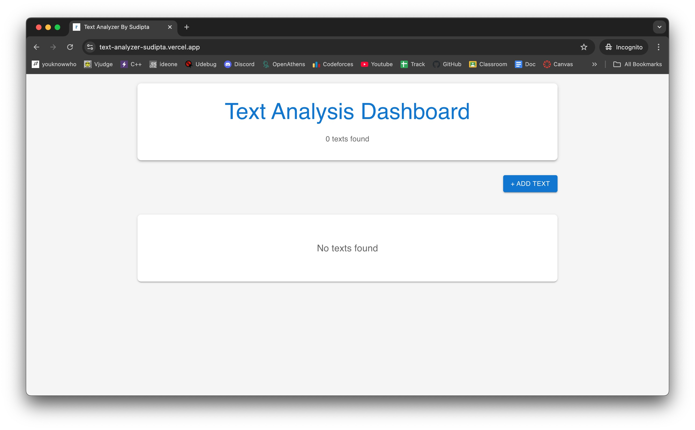
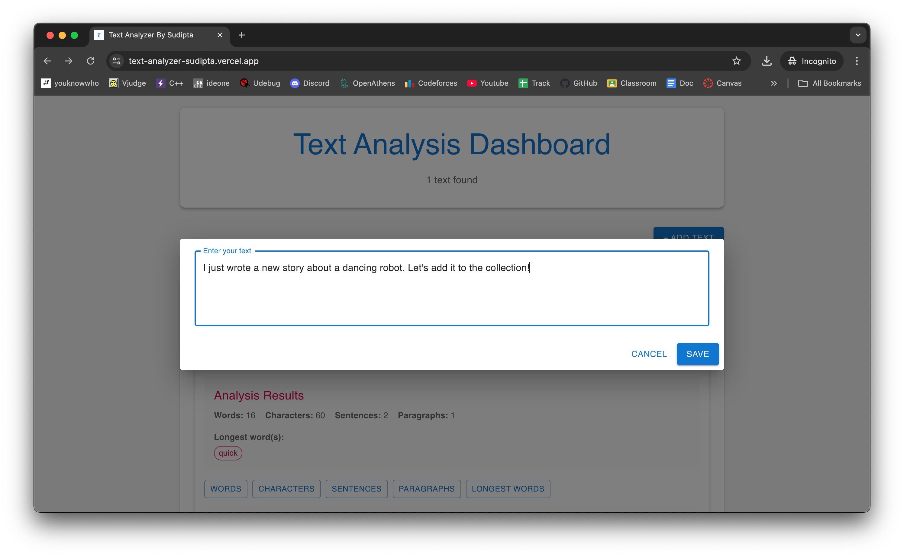
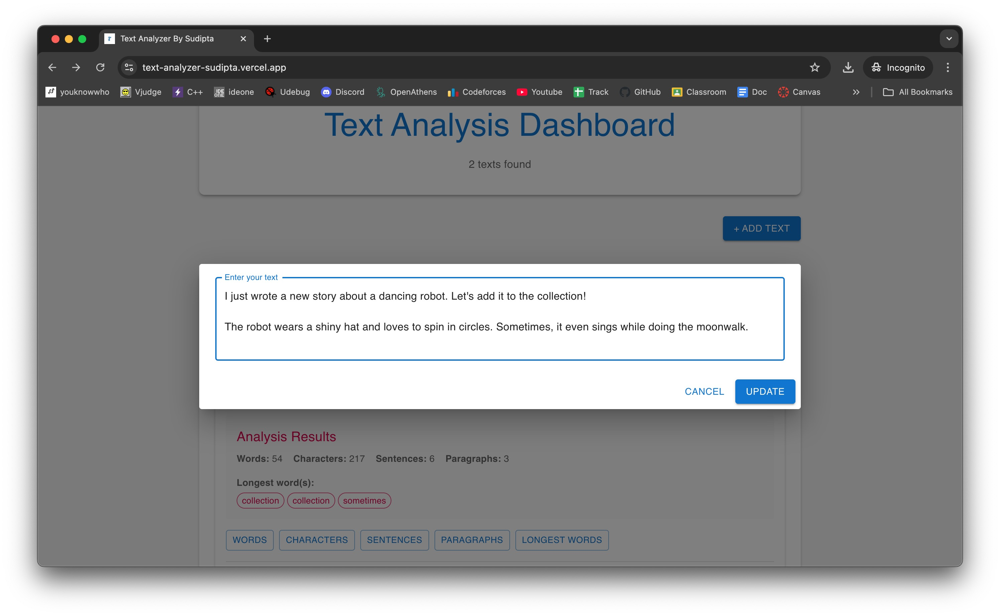
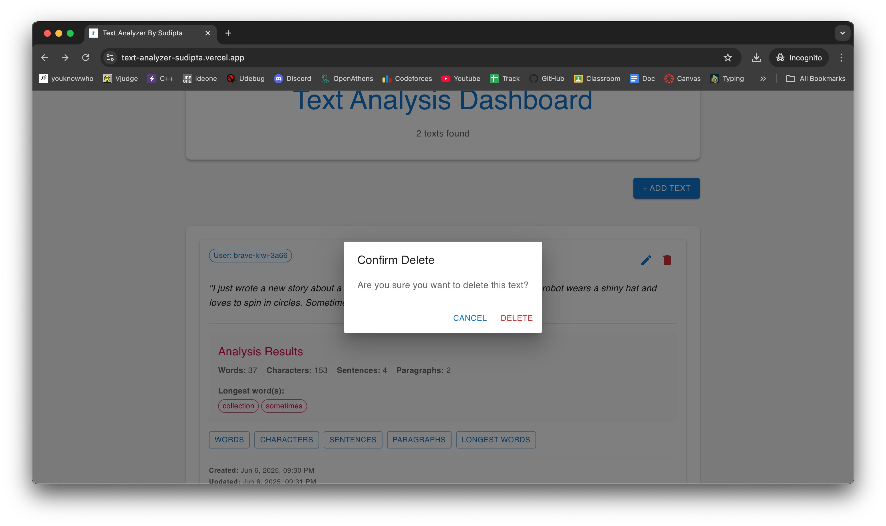
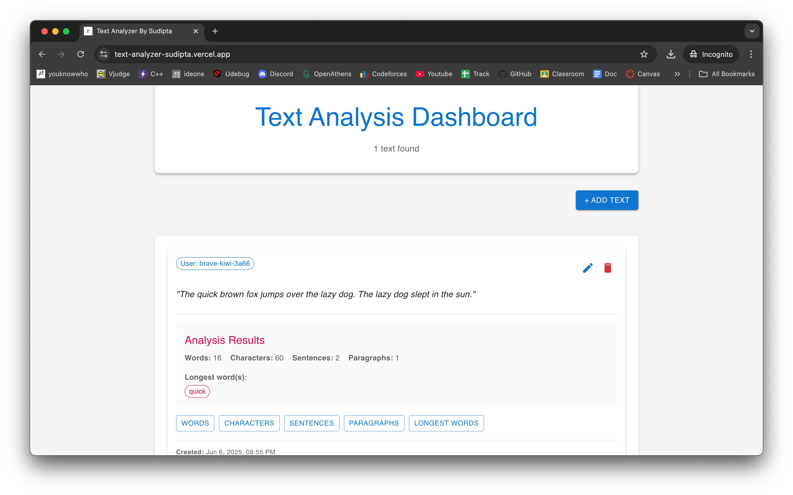
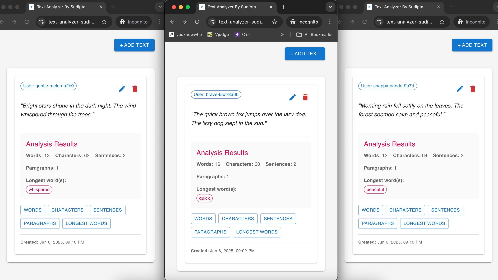

# text-analyzer

A simple pet project to analyze text with CRUD functionalities for a user. Every browser will act like a new user.

Tech Stack Used:

- Backend: Nodejs, express, mongoDB atlas, TypeScript
- Frontend: React js + vite, material UI, html, CSS

## LIVE PROJECT URL `https://text-analyzer-sudipta.vercel.app/`

## Steps to run the project locally

### For Frontend

- system must have node js & npm installed
- clone the repository, go to project directory, `cd frontend` then run following commands sequentially
- `npm install` -> to install all the dependencies
- `npm run dev` -> will run the frontend server
- create a .env file and put the backend server URL as
  `VITE_API_URL=http://localhost:3000/api`

### For Backend

- system must have node js & npm installed
- clone the repository, go to project directory, `cd backend` then run following commands sequentially
- `npm install` -> to install all the dependencies
- `npm run dev` -> will run the frontend server
- create a .env file and put the mongoDB atlas URL as
  `MONGO_URI=mongodb+srv://mrmandal:<DB_PASSWORD>@text-analyzer.wqajnkg.mongodb.net/?retryWrites=true&w=majority&appName=text-analyzer`
- replace `<DB_PASSWORD>` as mentioned in email OR create a mongo db atlas cluster and give the full url here to use your own db

## Project Functionalities

<figure style="text-align: center;">
  <figcaption>Landing Page</figcaption>
   
</figure>

<figure style="text-align: center;">
  <figcaption>Write Functionality</figcaption>
  
</figure>

<figure style="text-align: center;">
  <figcaption>Update Functionality</figcaption>
  
</figure>

<figure style="text-align: center;">
  <figcaption>Delete Functionality</figcaption>
  
</figure>

<figure style="text-align: center;">
  <figcaption>Count of words, characters, sentences, paragraphs, longest word in the paragraph Functionality</figcaption>
  
</figure>

<figure style="text-align: center;">
  <figcaption>User functionality: each browser is treated as a separate user, allowing them to add and analyze their own text</figcaption>
  
</figure>
